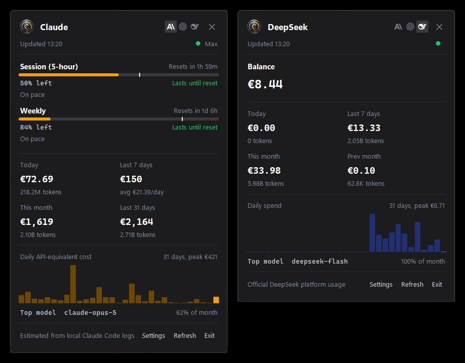

# ClaudeBar

Windows system tray application for tracking Claude Code and OpenAI Codex usage statistics.

Inspired by [CodexBar](https://github.com/steipete/CodexBar), which runs only on macOS.



## Features

ClaudeBar provides a dark-themed UI with real-time usage tracking for both Claude and OpenAI Codex.

The main window displays usage limits with gradient progress bars that transition from green through yellow to red as usage increases. Session and weekly limits are shown with countdown timers indicating when they reset. Cost tracking shows today's spend and 30-day totals with token counts formatted for readability.

Engine selection buttons in the header allow switching between Claude and Codex views. The data refreshes automatically in the background and can be manually triggered with the refresh button.

The tray icon displays a custom app icon if one exists at `resources/icons/app_icon.png`, otherwise it generates a dynamic icon that changes color based on usage level.

## Supported Engines

ClaudeBar reads OAuth tokens from command-line tools only. Desktop apps and web interfaces use different authentication systems (browser-based cookies) that are not compatible with the usage APIs.

**Supported:**

**Claude Code CLI** tracks session and weekly usage limits, token counts per model, and costs calculated from JSONL logs. Requires Claude Code CLI to be installed and authenticated.

**OpenAI Codex CLI** tracks session and weekly rate limits, token usage, and estimated costs from local logs. Requires Codex CLI with `codex login` completed.

**Not Supported:**

**Claude Desktop App** uses browser-based authentication stored in `%APPDATA%\Claude\` (Chromium profile cookies). This is a completely separate authentication system from the CLI's OAuth tokens, so ClaudeBar cannot read usage data from it.

**ChatGPT web interface** uses browser session cookies with no API access for usage metrics.

**GitHub Copilot** was investigated but the metrics API only provides usage data for organization and enterprise accounts. Individual users can view their Copilot usage at github.com/settings/copilot.

## Requirements

ClaudeBar requires Python 3.11 or higher and runs on Windows 10 and 11. You need Claude Code CLI installed for Claude tracking, and optionally Codex CLI with `codex login` completed for OpenAI tracking.

## Installation

Navigate to the claudebar directory and install dependencies:

```powershell
cd claudebar
pip install -r requirements.txt
```

Dependencies are minimal: pystray for system tray functionality, Pillow for image handling, and pyinstaller for building executables.

## Running

Start the application from the command line:

```powershell
python src/main.py
```

The app starts in the system tray. Left-click the tray icon to open the premium UI window, or right-click for a simple menu. Press Escape or click outside the window to close it.

## Building Standalone Executable

Use the build script to create a portable executable:

```powershell
.\build.ps1
```

The executable will be created at `dist/ClaudeBar.exe` (approximately 20MB). To also install to Windows startup folder:

```powershell
.\build.ps1 -Install
```

For a clean rebuild:

```powershell
.\build.ps1 -Clean
```

The build excludes numpy, scipy, and other heavy optional dependencies to keep the executable size small.

## Customizing the Icon

Place a custom PNG icon at `resources/icons/app_icon.png` to replace the default icon in both the system tray and UI header. For the standalone exe, also create an ICO version at `resources/icons/app_icon.ico` which will be embedded as the Windows executable icon. The build process bundles these resources automatically.

## Configuration

Configuration is stored in `%LOCALAPPDATA%\ClaudeBar\config.json` with the following options:

```json
{
  "refresh_interval": 300,
  "cli_timeout": 30,
  "warning_threshold": 80,
  "critical_threshold": 95,
  "show_notifications": true,
  "start_minimized": true,
  "currency": "USD",
  "claude_enabled": true,
  "codex_enabled": true
}
```

The refresh_interval controls how often data updates automatically in seconds. Warning and critical thresholds determine when the tray icon changes from green to yellow to red. Currency can be set to USD, EUR, RUB, or RON for cost display. Engine toggles allow enabling or disabling Claude and Codex tracking independently.

## Tray Context Menu

Right-clicking the tray icon shows a quick summary of usage for both providers. The Claude section displays today's cost, monthly cost, and token count since these values come from the JSONL logs and API. The OpenAI section shows session and weekly usage percentages along with token counts, as OpenAI's API provides rate limit information but not cost breakdowns.

## Data Sources

ClaudeBar reads OAuth tokens from CLI credential files only. It does not work with Claude Desktop App or ChatGPT web since these use browser-based authentication which is incompatible with the usage APIs.

Claude usage data comes from three sources. The OAuth API at api.anthropic.com provides session and weekly usage percentages using tokens from the Claude CLI credentials file at `~/.claude/.credentials.json`. JSONL logs in `~/.claude/projects/` provide token counts per model for cost calculation. The daily_stats.json file provides API-reported costs which are more accurate for billing purposes.

OpenAI/Codex usage data comes from the ChatGPT backend API using OAuth tokens from the Codex CLI credentials at `~/.codex/auth.json`. Local JSONL logs at `~/.codex/` provide token counts and cost estimates. Users must run `codex login` to authenticate before this data becomes available.

## OAuth Token Limitations

ClaudeBar does not store any authentication credentials. It reads OAuth tokens from the Claude Code CLI credentials file at `~/.claude/.credentials.json`. These tokens have a maximum validity of approximately 8 hours. When the token expires, ClaudeBar cannot fetch fresh usage data from the Anthropic API.

When the OAuth token expires, the app displays cached data with an amber indicator showing when the data was last refreshed (e.g., "cached from 2h ago"). The cached data persists in `%LOCALAPPDATA%\ClaudeBar\snapshot_cache.json` so usage information remains visible even when fresh data cannot be fetched.

To refresh the OAuth token, simply open Claude Code CLI in any terminal. Claude Code automatically refreshes its tokens on startup, which allows ClaudeBar to fetch fresh data again. There is no way to refresh tokens from within ClaudeBar itself since the app intentionally avoids handling authentication to maintain simplicity and security.

## Troubleshooting

If the tray icon is not visible, check the system tray overflow area by clicking the arrow in the taskbar. Windows may hide new tray icons by default.

If no data appears, verify that Claude Code has been used and created files in `~/.claude/projects/`. Check that the Claude CLI is authenticated by running `claude /usage` in a terminal.

If OpenAI data shows an error, ensure Codex CLI is installed and run `codex login` to authenticate with your OpenAI account.

If the window appears in the wrong position on multi-monitor setups, the window positioning logic targets the primary monitor's bottom-right corner near the system tray.

## License

MIT
