# Throne Windows Client Setup Guide

> Bypass censorship while maintaining direct access to Russian services
> Can be used for any country with censorship. 

---

## Table of Contents

1. [Overview](#1-overview)
2. [Installation & First Launch](#2-installation--first-launch)
3. [Adding Your Proxy Server](#3-adding-your-proxy-server)
4. [Creating the Bypass Russia Routing Profile](#4-creating-the-bypass-russia-routing-profile)
5. [Understanding the Routing Rules](#5-understanding-the-routing-rules)
6. [Adding Custom Domain Overrides](#6-adding-custom-domain-overrides)
7. [Configuring Global Routes Settings](#7-configuring-global-routes-settings)
8. [Basic Settings Configuration](#8-basic-settings-configuration)
9. [Activating the Configuration](#9-activating-the-configuration)
10. [Troubleshooting](#10-troubleshooting)
11. [Additional Resources](#11-additional-resources)

---

## 1. Overview

### Why This Guide Exists

**This is the most reliable way to perform custom domain-based routing on Windows.**

Traditionally, advanced routing requires:
- **Hardware router with OpenWrt firmware** — Not always available, especially when traveling
- **Complex router configuration** — Requires networking knowledge and physical access

**Enter Throne:** A powerful piece of open-sorcery - Windows client that brings OpenWrt-level routing capabilities to your PC. Created by the same amazing team, who originally were behind Nekoray (now archived), Throne offers:

✅ **Extremely customizable domain-based routing** — Route different services through different outbounds
✅ **Full tunnel mode (TUN/VPN)** — Works with all applications automatically
✅ **Native UDP proxying** — VoIP, video calls, gaming work out of the box
✅ **Multiple proxy protocols** — VLESS, VMess, Shadowsocks, Trojan, SOCKS, HTTP
✅ **Portable solution** — Take your routing configuration anywhere

**The Challenge:** Throne's power comes with complexity. The configuration can be confusing and cumbersome for unprepared users.

**This Guide's Purpose:** Provide a battle-tested configuration for bypassing Russian censorship while maintaining optimal performance for local services.

### What This Guide Configures

Throne will be set up to:

- Route blocked services (Google, AI platforms, blocked sites) through your proxy
- Keep Russian services (Yandex, VK, government sites) on direct connection
- Maintain fast local network access
- Enable DNS hijacking for proper domain resolution

### Prerequisites

**IMPORTANT:** Throne is a **client application only**. You must have access to a proxy server located outside Russia before using this guide.

#### Required:

1. **A proxy server in another country** (mandatory)
   - Protocol: VLESS with Reality/XTLS-Vision (recommended for Russia)
   - Location: Any country outside Russia with unrestricted internet
   - Setup: Linux VPS with XRAY-core

   **Don't have a server?** See [linux-vpn-manager](../linux-vpn-manager) for automated XRAY+VLESS+Reality deployment on a VPS.

2. **Throne 1.0.13 or later** installed on Windows client
   - Download from [GitHub Releases](https://github.com/throneproj/Throne/releases)

3. **Server connection details** (provided by your VPS setup):
   - Server address/IP and port
   - UUID (user ID)
   - Reality public key and short ID
   - SNI (Server Name Indication)

#### Recommended:

- Basic understanding of proxy concepts
- SSH access to your VPS for server management

### How It Works

```
┌─────────────────────────────────────────────────────────────┐
│                      Your Traffic                           │
└─────────────────────────┬───────────────────────────────────┘
                          │
                          ▼
┌─────────────────────────────────────────────────────────────┐
│                    Throne Routing                           │
├─────────────────────────────────────────────────────────────┤
│  1. DNS Hijack         → Intercept DNS queries              │
│  2. Private IPs        → Direct (LAN)                       │
│  3. Custom Overrides   → Your exceptions (Basic tab)        │
│  4. Blocked Services   → Proxy (Google, AI, etc.)           │
│  5. Russian Services   → Direct (Yandex, VK, .ru)           │
│  6. Everything Else    → Default outbound (proxy)           │
└─────────────────────────────────────────────────────────────┘
```

---

## 2. Installation & First Launch

1. Download Throne from [GitHub Releases](https://github.com/throneproj/Throne/releases)
2. Extract and run `Throne.exe`
3. Allow firewall access when prompted
4. Throne icon appears in system tray

*Note: The main window shows your server list and connection status. On first launch, this will be empty until you add your first proxy server.*

---

## 3. Adding Your Proxy Server

### Import via Link

1. Copy your VLESS share link (starts with `vless://...`)
2. In Throne: **Profiles** → **Add profile from clipboard** (or `Ctrl+V`)

### Import via QR Code

1. **Profiles** → **Scan QR Code**
2. Point camera at QR code

### Editing Server Settings

> **Hidden feature:** To edit an existing server profile, **double-click the Address column** in the server list (not just the row — specifically click on the address text).

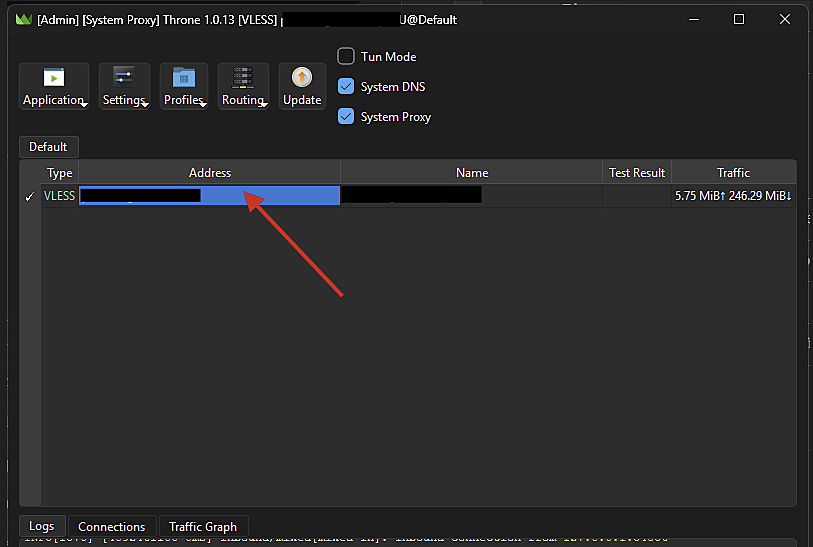
*Double-click the Address column (red arrow) to open the Edit dialog*

This opens the **Edit** dialog with all server settings:

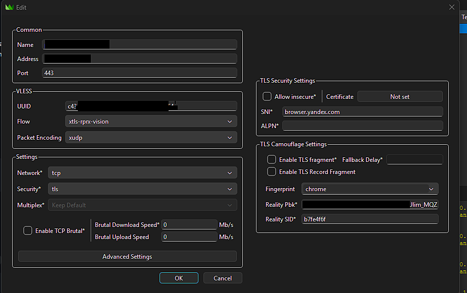
*Edit dialog showing VLESS settings, TLS Security Settings (SNI, Reality Pbk/SID), and TLS Camouflage (Fingerprint)*

| Section | Settings |
|---------|----------|
| **Common** | Name, Address, Port |
| **VLESS** | UUID, Flow (`xtls-rprx-vision`), Packet Encoding (`xudp`) |
| **TLS Security** | Allow insecure, SNI, ALPN, Certificate |
| **TLS Camouflage** | TLS fragment, Fingerprint, Reality Pbk, Reality SID |
| **Settings** | Network, Security, Multiplex |

Click **Advanced Settings** button for additional options:

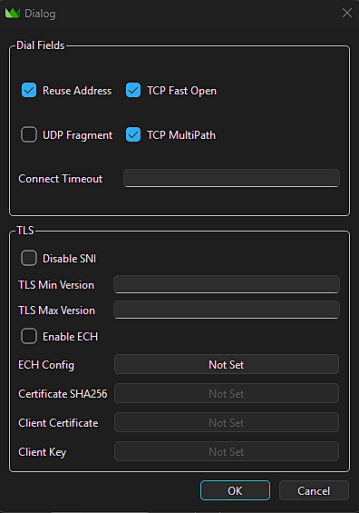
*Advanced Settings dialog showing Dial Fields (Reuse Address, TCP Fast Open, UDP Fragment, TCP MultiPath) and TLS settings*

| Section | Settings |
|---------|----------|
| **Dial Fields** | Reuse Address, TCP Fast Open, UDP Fragment, TCP MultiPath, Connect Timeout |
| **TLS** | Disable SNI, Min/Max Version, Enable ECH, Certificates |

### Recommended Server Settings for Russia

Configure these in the **Edit** dialog (double-click Address to open):

**Main Settings:**

| Field | Recommended Value | Location |
|-------|-------------------|----------|
| Flow | `xtls-rprx-vision` | VLESS section |
| Packet Encoding | `xudp` | VLESS section |
| SNI | `browser.yandex.com` (or similar trusted domain) | TLS Security Settings |
| Fingerprint | `chrome` | TLS Camouflage Settings |
| Reality Pbk | Your server's public key | TLS Camouflage Settings |
| Reality SID | Your server's short ID | TLS Camouflage Settings |
| Multiplex | `Keep Default` (disabled) | Settings section |

**Advanced Settings** (click button at bottom):

| Setting | Recommended | Notes |
|---------|-------------|-------|
| ✅ Reuse Address | Checked | Allow address reuse |
| ✅ TCP Fast Open | Checked | Reduce connection latency |
| ☐ UDP Fragment | **Unchecked** | Keep off — fragmentation causes issues |
| ✅ TCP MultiPath | Checked | MPTCP support if available |

> **Important:** XTLS-Vision and Multiplexing are mutually exclusive. For Russia, Vision provides better anti-detection — keep Multiplex at "Keep Default" or disabled.

---

## 4. Creating the Bypass Russia Routing Profile

### Method A: Download Pre-built Profile (Recommended)

1. Click **Routing** in the toolbar
2. Hover over **Download Profiles**
3. Select **Bypass_Russia** from the submenu

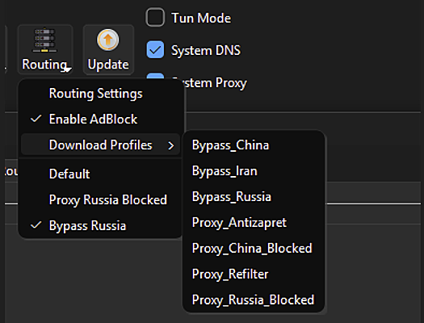
*Routing dropdown menu showing Download Profiles submenu with Bypass_Russia option*

### Method B: Manual JSON Installation

If the download fails (jsdelivr CDN may be blocked), install manually:

1. Close Throne completely
2. Navigate to the config directory:
   ```
   C:\Users\<your-username>\AppData\Roaming\Throne\config\route_profiles\
   ```
3. Create or replace `2.json` with the following content:

```json
{
    "default_outbound": -1,
    "id": 2,
    "name": "Bypass Russia",
    "rules": [
        {
            "actionType": "hijack-dns",
            "invert": false,
            "ip_is_private": false,
            "ip_version": "",
            "name": "hijack dns enable",
            "network": "",
            "noDrop": false,
            "outboundID": -2,
            "override_address": "",
            "override_port": 0,
            "protocol": "dns",
            "rejectMethod": "",
            "simple_action": 32759,
            "sniffOverrideDest": false,
            "source_ip_is_private": false,
            "strategy": "",
            "type": 0
        },
        {
            "actionType": "route",
            "invert": false,
            "ip_is_private": true,
            "ip_version": "",
            "name": "all private IPs are direct",
            "network": "",
            "noDrop": false,
            "outboundID": -2,
            "override_address": "",
            "override_port": 0,
            "protocol": "",
            "rejectMethod": "",
            "simple_action": 0,
            "sniffOverrideDest": false,
            "source_ip_is_private": false,
            "strategy": "",
            "type": 0
        },
        {
            "actionType": "route",
            "invert": false,
            "ip_is_private": false,
            "ip_version": "",
            "name": "Geo Abroad Routing",
            "network": "",
            "noDrop": false,
            "outboundID": -1,
            "override_address": "",
            "override_port": 0,
            "protocol": "",
            "rejectMethod": "",
            "rule_set": [
                "geoip-google",
                "geosite-google",
                "geoip-ru-blocked",
                "geosite-openai",
                "geosite-bing",
                "geosite-category-ai-!cn"
            ],
            "simple_action": 0,
            "sniffOverrideDest": false,
            "source_ip_is_private": false,
            "strategy": "",
            "type": 0
        },
        {
            "actionType": "route",
            "invert": false,
            "ip_is_private": false,
            "ip_version": "",
            "name": "Geo Routing Russia",
            "network": "",
            "noDrop": false,
            "outboundID": -2,
            "override_address": "",
            "override_port": 0,
            "protocol": "",
            "rejectMethod": "",
            "rule_set": [
                "geoip-ru",
                "geosite-ru",
                "geosite-category-ru",
                "geosite-ru-available-only-inside"
            ],
            "simple_action": 0,
            "sniffOverrideDest": false,
            "source_ip_is_private": false,
            "strategy": "",
            "type": 0
        }
    ]
}
```

4. Restart Throne
5. Go to **Routing** → select **Bypass Russia**

---

## 5. Understanding the Routing Rules

The profile contains four rules processed in order:

### Rule 1: DNS Hijacking

| Property | Value |
|----------|-------|
| Action | `hijack-dns` |
| Protocol | `dns` |
| Purpose | Intercepts all DNS queries for proper routing decisions |

> **Required:** Without this, domain-based rules won't work correctly.

### Rule 2: Private IPs → Direct

| Property | Value |
|----------|-------|
| Action | `route` → direct |
| Match | `ip_is_private: true` |
| Purpose | LAN devices (192.168.x.x, 10.x.x.x) stay accessible |

### Rule 3: Geo Abroad Routing → Proxy

Traffic matching these rule-sets goes through your proxy server:

| Rule-set | What it covers |
|----------|----------------|
| `geoip-google` | Google's IP addresses |
| `geosite-google` | Google domains (google.com, youtube.com, etc.) |
| `geoip-ru-blocked` | IPs blocked by Russian government (runetfreedom) |
| `geosite-openai` | OpenAI/ChatGPT domains |
| `geosite-bing` | Microsoft Bing & Copilot |
| `geosite-category-ai-!cn` | All AI services (Claude, Gemini, Perplexity, etc.) |

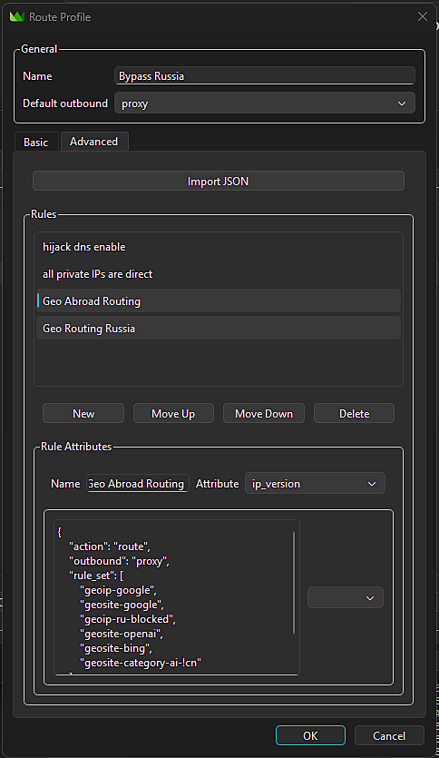
*Route Profile editor showing Geo Abroad Routing rule with rule_set list (geoip-google, geosite-google, geosite-openai, etc.)*

### Rule 4: Geo Routing Russia → Direct

Traffic matching these rule-sets bypasses the proxy:

| Rule-set | What it covers |
|----------|----------------|
| `geoip-ru` | Russian IP addresses |
| `geosite-ru` | Russian domains (.ru, Yandex, VK, etc.) |
| `geosite-category-ru` | Russian service categories |
| `geosite-ru-available-only-inside` | Services only accessible from Russia |

### Rule Processing Order

Rules are evaluated top-to-bottom. First match wins:

```
Traffic arrives
    │
    ▼
┌─ DNS protocol? ──────────────────► Hijack DNS
│
├─ Private IP? ────────────────────► Direct
│
├─ Matches Geo Abroad rule-sets? ──► Proxy
│
├─ Matches Geo Russia rule-sets? ──► Direct
│
└─ No match ───────────────────────► Default outbound (proxy)
```

---

## 6. Adding Custom Domain Overrides

Sometimes geo rules don't cover everything. Use the **Basic tab** to add custom exceptions.

### Accessing the Basic Tab

1. **Routing** → **Routing Settings**
2. Go to **Route** tab
3. Select your profile (e.g., "Bypass Russia")
4. Click **Edit**
5. Switch to **Basic** tab

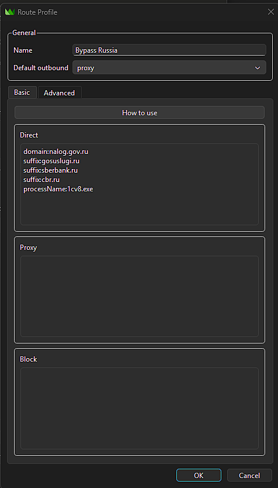
*Route Profile editor showing Basic tab with Direct, Proxy, and Block text boxes for custom domain overrides*

### Basic Tab Layout

| Box | Action | Use Case |
|-----|--------|----------|
| **Direct** | Always bypass proxy | Russian services incorrectly routed, internal sites |
| **Proxy** | Always use proxy | Blocked sites not in geo lists, new services |
| **Block** | Block completely | Ads, telemetry, unwanted domains |

### Rule Syntax

Click **"How to use"** button for official reference. Supported formats:

| Prefix | Example | Matches |
|--------|---------|---------|
| `domain:` | `domain:example.com` | Exact domain only |
| `suffix:` | `suffix:google.com` | google.com + all subdomains |
| `keyword:` | `keyword:facebook` | Any domain containing "facebook" |
| `regex:` | `regex:.*\.ru$` | Regex pattern matching |
| `ruleset:` | `ruleset:geosite-netflix` | Built-in or remote ruleset |
| `ip:` | `ip:192.168.0.0/16` | IP CIDR range |
| `processName:` | `processName:chrome.exe` | Match by process name |
| `processPath:` | `processPath:C:\Program Files\...` | Match by full path |


*"Simple rule manual" dialog showing all supported rule formats (domain:, suffix:, keyword:, regex:, ruleset:, ip:, processName:, processPath:)*

### Example: Force Direct

Add to **Direct** box:

```
domain:nalog.gov.ru
suffix:gosuslugi.ru
suffix:sberbank.ru
suffix:cbr.ru
processName:1cv8.exe
```

### Example: Force Proxy

Add to **Proxy** box:

```
suffix:rutracker.org
suffix:linkedin.com
suffix:medium.com
keyword:torrent
```

### Example: Block

Add to **Block** box:

```
suffix:doubleclick.net
suffix:ads.google.com
keyword:telemetry
```

### How It Works

When you save, Basic tab entries are converted to proper routing rules:

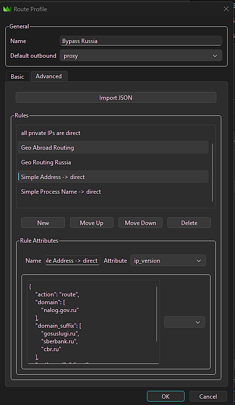
*Advanced tab showing generated "Simple Address -> direct" and "Simple Process Name -> direct" rules added after geo rules*

## Important: Currently, simple rules are added at the end of the rule list. For them to work as true overrides, use **Move Up** button in Advanced tab to position them before the geo rules.

Recommended final order:

1. hijack dns enable
2. all private IPs are direct
3. **Simple Address -> direct** ← Move here
4. **Simple Address -> proxy** ← Move here
5. Geo Abroad Routing
6. Geo Routing Russia

---

## 7. Configuring Global Routes Settings

Click **Routing** → **Routing Settings** to configure global options.

### Common Tab

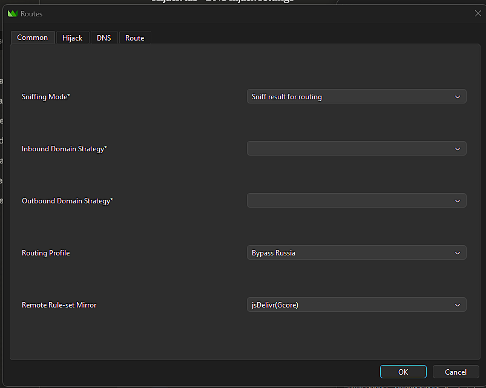
*Routes dialog showing Common tab with Sniffing Mode, Routing Profile, and Remote Rule-set Mirror options*

| Setting | Recommended Value | Purpose |
|---------|-------------------|---------|
| Sniffing Mode | `Sniff result for routing` | Enables domain detection from TLS/HTTP |
| Routing Profile | `Bypass Russia` | Select your profile |
| Remote Rule-set Mirror | `jsDelivr(Gcore)` | CDN for downloading rule-sets |

### Hijack Tab

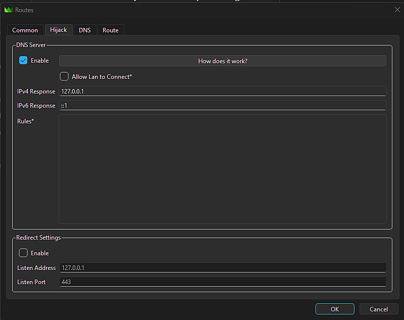
*Routes dialog showing Hijack tab with DNS Server settings enabled (IPv4: 127.0.0.1, IPv6: ::1)*

| Setting | Recommended Value | Purpose |
|---------|-------------------|---------|
| Enable | ✓ Checked | Enables DNS server for hijacking |
| IPv4 Response | `127.0.0.1` | Localhost response |
| IPv6 Response | `::1` | Localhost response |

### DNS Tab

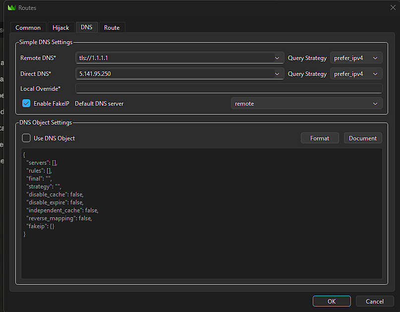
*Routes dialog showing DNS tab with Remote DNS (tls://1.1.1.1), Direct DNS (5.141.95.250), and FakeIP settings*

| Setting | Recommended Value | Purpose |
|---------|-------------------|---------|
| Remote DNS | `tls://8.8.8.8` or `tls://1.1.1.1` | DNS for proxied queries (encrypted) |
| Direct DNS | `5.141.95.250` | Russian DNS for direct traffic |
| Enable FakeIP | ✓ Checked | Improves routing accuracy |
| Default DNS server | `remote` | Use remote DNS by default |

### Route Tab

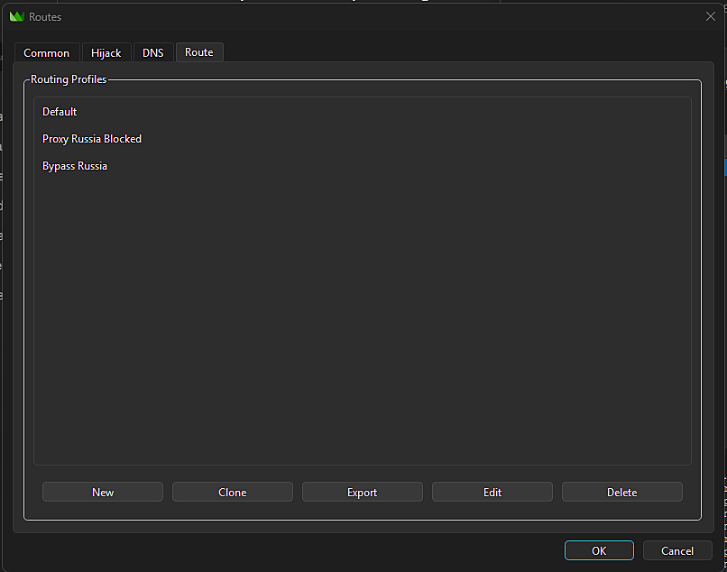
*Routes dialog showing Route tab with list of routing profiles (Default, Proxy Russia Blocked, Bypass Russia) and management buttons*

This tab shows all routing profiles. Use to:

- **New** — Create new profile
- **Clone** — Duplicate existing profile
- **Export** — Save profile to file
- **Edit** — Open profile editor
- **Delete** — Remove profile

---

## 8. Basic Settings Configuration

Click **Settings** in the toolbar.

### Common Tab


*Basic Settings dialog showing Common tab with Listen Address (127.0.0.1), Port (2080), Network Settings, and Test Settings*

| Setting | Recommended Value | Purpose |
|---------|-------------------|---------|
| Listen Address | `127.0.0.1` | Localhost only |
| Listen Port | `2080` | Proxy port for applications |
| Allow updating to beta | ✓ Recommended | Get latest features |
| Latency Test URL | `http://cp.cloudflare.com/` | For connection testing |

### Core Tab

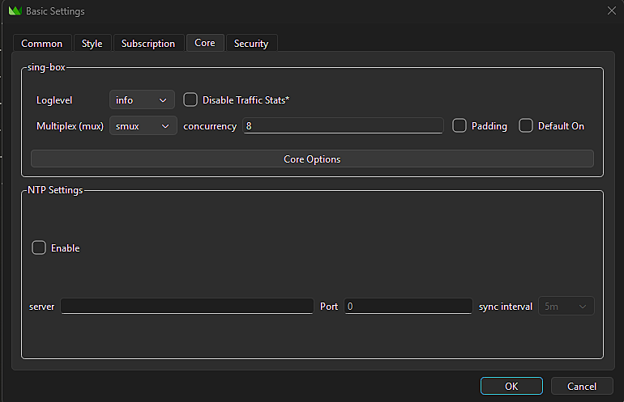
*Basic Settings dialog showing Core tab with sing-box settings: Loglevel (info) and Multiplex options*

| Setting | Recommended Value | Purpose |
|---------|-------------------|---------|
| Loglevel | `info` | Balance between detail and noise |
| Multiplex (mux) | `smux` | Protocol if multiplex is used |
| Default On | ☐ **Unchecked** | Global multiplex toggle |

> **Important:** Keep "Default On" unchecked when using XTLS-Vision flow. Multiplex is configured per-server in the Edit dialog → Settings → Multiplex field.

### Security Tab

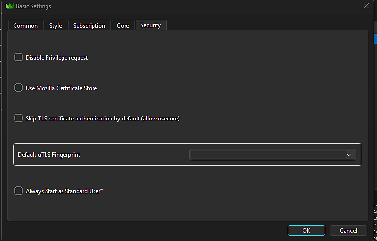
*Basic Settings dialog showing Security tab with certificate options and Default uTLS Fingerprint setting*

Leave defaults unless you have specific requirements. The **Default uTLS Fingerprint** can be set globally here or per-server in outbound configuration.

---

## 9. Activating the Configuration

### Connect to Proxy

1. In the main window, select your server from the list
2. Enable **System Proxy** checkbox
3. Optionally enable **System DNS** for system-level DNS hijacking
4. Click the server row to connect (or double-click)

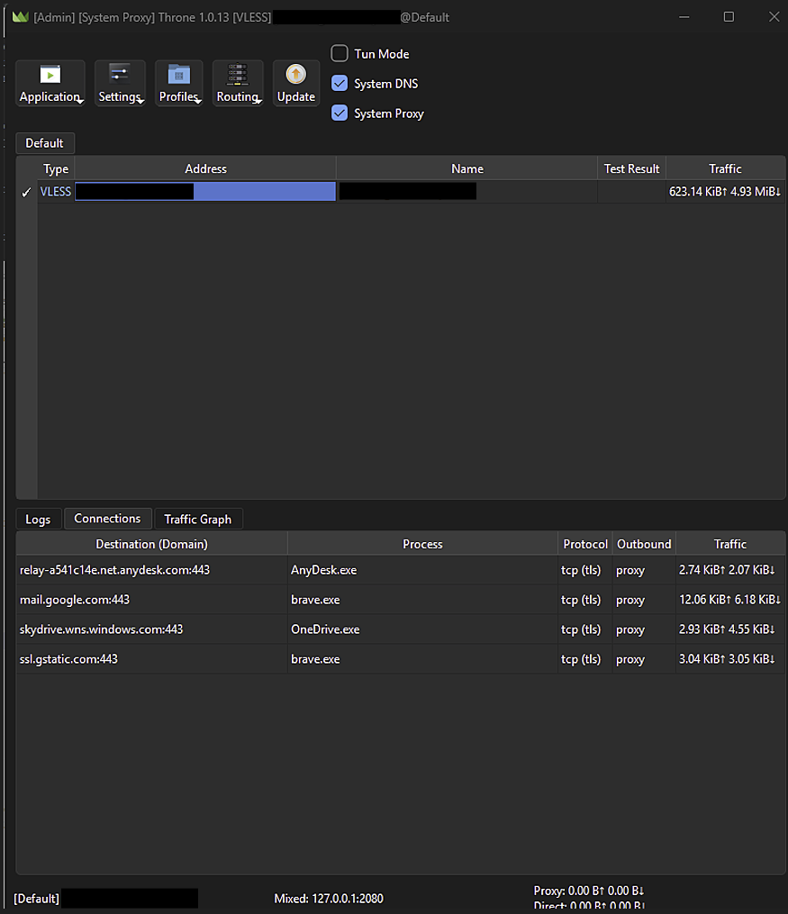
*Throne main window showing connected state with System DNS and System Proxy enabled. The Connections tab shows active traffic routing.*

### System Tray Options

Right-click the Throne icon in system tray:

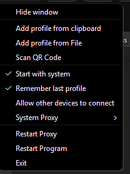
*System tray context menu showing Start with system, Remember last profile, Allow other devices to connect, and other options*

| Option | Recommendation |
|--------|----------------|
| Start with system | ✓ Enable for autostart |
| Remember last profile | ✓ Reconnects automatically |
| Allow other devices to connect | Only if sharing proxy on LAN |

### Verify Correct Operation

Check the **Connections** tab to confirm routing:


*Connections tab showing active connections with their routing decisions - mail.google.com and ssl.gstatic.com go through "proxy", while OneDrive uses "direct"*

| Destination | Expected Outbound |
|-------------|-------------------|
| google.com | `proxy` |
| youtube.com | `proxy` |
| claude.ai | `proxy` |
| yandex.ru | `direct` |
| gosuslugi.ru | `direct` |
| 192.168.x.x | `direct` |

---

## 10. Troubleshooting

### Rule-sets fail to download (EOF error)

**Symptom:**
```
LoadConfig return error
start service: initialize rule-set: Get "https://testingcf.jsdelivr.net/...": EOF
```

**Cause:** jsdelivr CDN is blocked or throttled in your network.

**Solution — Bootstrap method:**

1. Create a simple profile with only domain rules (no rule-sets):
   ```
   Direct box: (empty)
   Proxy box:
   suffix:jsdelivr.net
   suffix:github.com
   suffix:githubusercontent.com
   suffix:google.com
   ```

2. Connect using the simple profile
3. Switch to "Bypass Russia" — rule-sets will download through active proxy
4. Rule-sets are cached for future use

### Connection works but some sites don't load

1. Check the **Connections** tab to see which outbound is being used
2. If wrong outbound, add domain to appropriate box in Basic tab
3. Verify DNS settings are correct
4. Try **Restart Program** from system tray

### Russian sites go through proxy (slow)

Add them to **Direct** box in Basic tab:

```
suffix:problemsite.ru
```

Then reorder rules in Advanced tab if needed.

### Blocked sites still blocked

Add them to **Proxy** box in Basic tab:

```
suffix:blockedsite.com
```

### Multiplexing doesn't work with XTLS-Vision

**This is expected.** XTLS-RPRX-Vision flow and multiplexing are mutually exclusive. Vision provides better anti-detection for Russian networks — keep multiplexing disabled.

### "Invalid sing-box rule-set file" error

Rule-set format may have changed. Try:

1. Delete cached rule-sets:
   ```
   C:\Users\<username>\AppData\Roaming\Throne\cache\
   ```
2. Restart Throne
3. Rule-sets will re-download

---

## 11. Additional Resources

### Rule-set Sources

Throne compiles rule-sets from multiple sources at build time. Rule-sets are downloaded as `.srs` (sing-box rule-set) binary files.

#### Source 1: runetfreedom (Russia-specific) - Hardcoded

| Rule-set | Type | Description |
|----------|------|-------------|
| `geoip-ru-blocked` | IP | IPs blocked by Russian government |
| `geosite-ru-blocked` | Domain | Domains blocked in Russia |
| `geoip-ru-blocked-community` | IP | Community-maintained blocked IPs |
| `geosite-ru-available-only-inside` | Domain | Sites only accessible from within Russia |
| `geoip-re-filter` | IP | RE filter IPs |
| `geosite-no-russia-hosts` | Domain | Hosts to exclude from Russia routing |

**Source:** [runetfreedom/russia-v2ray-rules-dat](https://github.com/runetfreedom/russia-v2ray-rules-dat)
**Format:** Same data as XRAY `.dat` files, converted to sing-box `.srs` format
**Update:** Release branch updated regularly

#### Source 2: MetaCubeX/meta-rules-dat (Standard geo) - Dynamic

Fetched via GitHub API from `sing` branch. Provides comprehensive global routing rules.

**Common GeoIP rule-sets:**
- `geoip-cn`, `geoip-us`, `geoip-ru`, `geoip-jp`, `geoip-de`, `geoip-gb` (countries)
- `geoip-google`, `geoip-telegram`, `geoip-twitter`, `geoip-facebook`, `geoip-netflix`
- `geoip-private` (RFC1918 private addresses)

**Common GeoSite rule-sets:**
- **Countries:** `geosite-cn`, `geosite-ru`, `geosite-category-ru`
- **Services:** `geosite-google`, `geosite-youtube`, `geosite-twitter`, `geosite-facebook`, `geosite-telegram`, `geosite-netflix`, `geosite-spotify`, `geosite-apple`, `geosite-microsoft`
- **AI Services:** `geosite-openai`, `geosite-bing` (includes Copilot)
- **Categories:** `geosite-category-ads-all`, `geosite-category-games`, `geosite-geolocation-!cn` (non-China sites)
- **Special:** `geosite-private` (localhost, LAN domains)

**Source:** [MetaCubeX/meta-rules-dat](https://github.com/MetaCubeX/meta-rules-dat) (sing branch)
**Count:** Hundreds of rule-sets dynamically discovered
**Base URL:** `https://raw.githubusercontent.com/MetaCubeX/meta-rules-dat/sing/geo/`

#### Source 3: Chocolate4U/Iran-sing-box-rules (Iran/region-specific) - Dynamic

| Rule-set Category | Examples |
|-------------------|----------|
| **Country IP/domains** | `geoip-ir`, `geosite-ir`, `geoip-af`, `geoip-cn`, `geosite-cn` |
| **Security** | `geosite-malware`, `geosite-phishing`, `geosite-cryptominers`, `geoip-malware` |
| **Ads** | `geosite-category-ads-all` |

**Source:** [Chocolate4U/Iran-sing-box-rules](https://github.com/Chocolate4U/Iran-sing-box-rules) (rule-set branch)

#### Source 4: hiddify/hiddify-geo (Country-specific) - Dynamic

Provides additional country-specific rule-sets.

**Source:** [hiddify/hiddify-geo](https://github.com/hiddify/hiddify-geo) (rule-set branch)

### Available Rule-sets by Category

#### AI Services

| Rule-set | Coverage | Source |
|----------|----------|--------|
| `geosite-openai` | OpenAI/ChatGPT (chatgpt.com, openai.com, ai.com, oaiusercontent.com) | MetaCubeX |
| `geosite-bing` | Microsoft Bing & Copilot (bing.com, copilot.microsoft.com) | MetaCubeX |
| `geosite-google` | Google services including Gemini (gemini.google.com, bard.google.com) | MetaCubeX |

**Note:** Claude/Anthropic (claude.ai, anthropic.com) requires manual configuration via Basic tab domain rules, as it's not included in standard geo rule-sets.

#### Streaming & Entertainment

- `geosite-netflix`, `geoip-netflix`
- `geosite-youtube`
- `geosite-spotify`
- `geosite-disney`, `geosite-hbo`
- `geosite-bilibili` (China video)
- `geosite-tiktok`

#### Social Media

- `geosite-twitter`, `geoip-twitter`
- `geosite-facebook`, `geoip-facebook`
- `geosite-telegram`, `geoip-telegram`

#### Technology & Development

- `geosite-github`
- `geosite-apple`, `geoip-apple`
- `geosite-microsoft`
- `geosite-amazon`

#### Ads & Security

- `geosite-category-ads-all` (comprehensive ad blocking)
- `geosite-malware`, `geoip-malware`
- `geosite-phishing`, `geoip-phishing`
- `geosite-cryptominers`

### How to Find Available Rule-sets

1. **Throne's autocomplete:** Start typing in the route editor's rule-set field — shows all available entries
2. **Complete mapping:** [throneproj/routeprofiles/srslist.h](https://raw.githubusercontent.com/throneproj/routeprofiles/rule-set/srslist.h)
3. **Source repositories:** Browse the GitHub repos listed above

### Naming Convention

- File: `geoip-XX.srs` → Throne name: `geoip-XX`
- File: `geosite-XX.srs` → Throne name: `geosite-XX`
- Prefix `geoip-` = IP address rules
- Prefix `geosite-` = Domain/URL rules

### Links

- **Throne GitHub:** https://github.com/throneproj/Throne
- **Throne Documentation:** https://throneproj.github.io/
- **sing-box Documentation:** https://sing-box.sagernet.org/
- **Route Profiles Repository:** https://github.com/throneproj/routeprofiles

---

## Appendix: Quick Reference

### Outbound IDs in JSON

| ID | Meaning |
|----|---------|
| `-1` | Proxy (selected server) |
| `-2` | Direct |
| `-3` | Block |

### Rule Types

| Type | Value | Description |
|------|-------|-------------|
| Custom | `0` | Advanced rule (manual) |
| Simple Address | `1` | Domain/IP from Basic tab |
| Simple Process Name | `2` | Process name from Basic tab |
| Simple Process Path | `3` | Process path from Basic tab |

### Common Domain Prefixes

```
suffix:   → domain + all subdomains
domain:   → exact domain only
keyword:  → contains string
regex:    → regular expression
ip:       → CIDR notation
ruleset:  → reference rule-set
```

---

*Guide version: 1.0 | Throne version: 1.0.13 | Last updated: January 2026*
